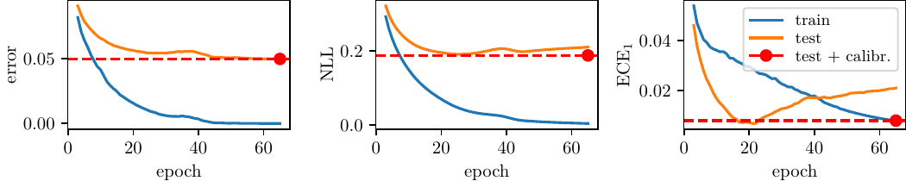
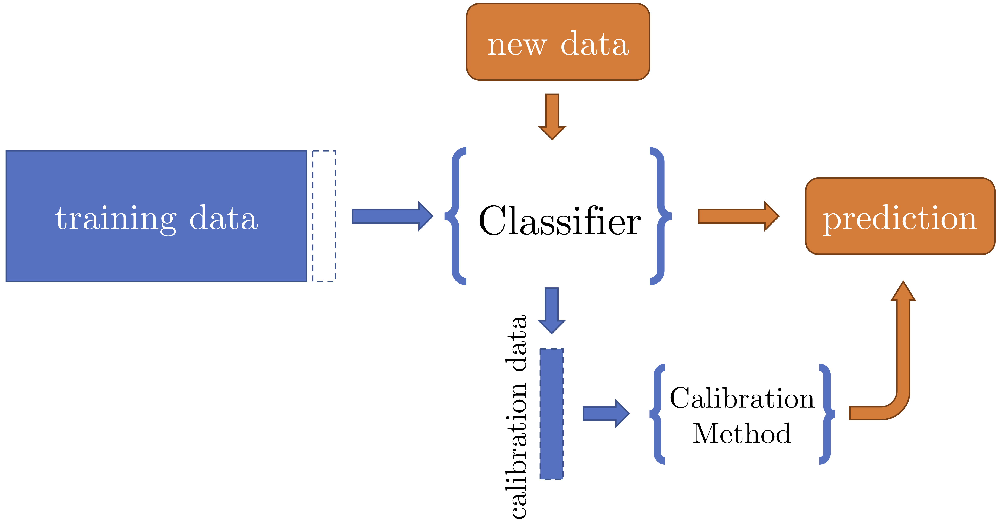
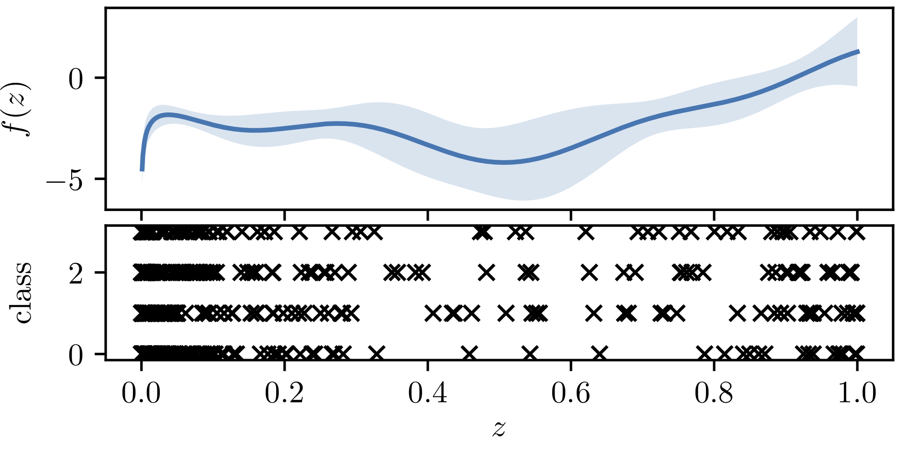
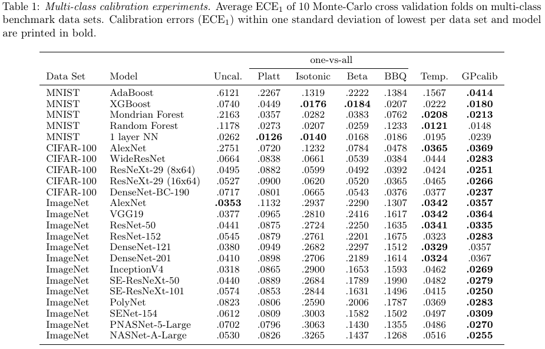

# Non-Parametric Calibration for Classification

[](https://travis-ci.org/JonathanWenger/pycalib)

This repository provides an implementation of the paper ["Non-Parametric Calibration for Classification"](https://arxiv.org/abs/1906.04933) (Jonathan Wenger, Hedvig Kjellström, Rudolph Triebel) published at AISTATS 2020. All results presented in our work were produced with this code.

<p align="center">
  
</p>


<!---
* [Introduction](#introduction)
* [Installation and Documentation](#usage)
* [Datasets and Experiments](#data)
* [Publication](#publication)
* [License and Contact](#contact)
--->

## <a name="usage">Introduction</a>

Many applications of classification methods not only require high accuracy but also reliable estimation of predictive uncertainty. However, while many current classification frameworks, in particular deep neural networks, achieve high accuracy, they tend to incorrectly estimate uncertainty. We provide a method that adjusts the confidence estimates of a general classifier such that they approach the probability of classifying correctly. In contrast to existing approaches, our calibration method employs a non-parametric representation using a latent Gaussian process, and is specifically designed for multi-class classification. It can be applied to any classifier that outputs confidence estimates and is not limited to neural networks. In the experiments included in this repository, we show the universally strong performance of our method across different classifiers and benchmark data sets, in particular for state-of-the art neural network architectures.

<p align="center">
  
  
</p>

## <a name="usage">Installation and Documentation</a>
The code was developed in Python 3.6 under Ubuntu (18.04). You can install this Python 3 package using `pip` (or `pip3`):
```bash
pip install setuptools numpy scipy scikit-learn cython
pip install git+https://github.com/JonathanWenger/pycalib.git
```
Note that some dependencies need to be installed separately since a subset of experiments rely on [`scikit-garden`](https://github.com/scikit-garden/scikit-garden). Alternatively you can clone this repository with
```bash
pip install setuptools numpy scipy scikit-learn cython
git clone https://github.com/JonathanWenger/pycalib
cd pycalib
python setup.py install
```
For tips on getting started and how to use this package please refer to the [documentation](https://jonathanwenger.github.io/pycalib/).

## <a name="data">Experiments and Benchmark Datasets</a>

We performed calibration experiments for binary and multi-class benchmark datasets from computer vision for a range of classifiers and calibration methods. We found that GP calibration performed particularly well on large-scale architectures and challenging data sets.
<p align="center">
  
</p>

The experiments can be reproduced by using the scripts in `benchmark` and `figures`. The datasets we used and how to obtain them are listed below.

- **PCam**: Due to the size of the data, only a script replicating the experiments is provided. The data can be downloaded from the
[PCam repository](https://github.com/basveeling/pcam).
- **KITTI**: The repository includes 64-dimensional features extracted from KITTI sequences compressed in a zip file
`datasets/kitti/kitti_data.zip`.
- **MNIST**: A script will automatically download the MNIST dataset if needed.
- **CIFAR-100**: When the CIFAR-100 experiment is run, there is an option to automatically download the dataset.
- **ImageNet 2012**: Due to the size of the data, only a script replicating the experiments is provided. The ImageNet validation data can be
obtained from the [ImageNet website](http://www.image-net.org).


## <a name="publication">Publication</a>
If you use this repository in your research, please cite the following paper:

_"Non-Parametric Calibration for Classification"_ ([PDF](https://arxiv.org/pdf/1906.04933.pdf)), Jonathan Wenger, Hedvig Kjellström and Rudolph Triebel

```bibtex
@InProceedings{wenger2020calibration,
  title         = {Non-Parametric Calibration for Classification},
  author        = {Jonathan Wenger and Hedvig Kjellstr{\"o}m and Rudolph Triebel},
  booktitle     = {Proceedings of the 23rd International Conference on Artificial Intelligence and Statistics (AISTATS)},
  year          = {2020},
  series        = {Proceedings of Machine Learning Research},
  keywords      = {calibration, non-parametric, gaussian processes, classification},
  url           = {https://github.com/JonathanWenger/pycalib}
}
```

## <a name="contact"> License and Contact</a>

This work is released under the [MIT License](LICENSE).

Please submit an [issue](https://github.com/JonathanWenger/pycalib/issues/new) to report bugs or request changes.
