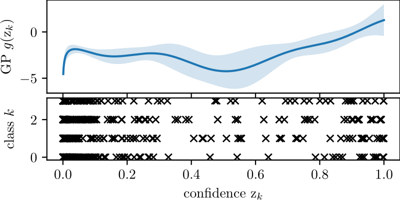

# Non-Parametric Calibration for Classification

[](https://travis-ci.com/JonathanWenger/pycalib)

<p align="center">
  
</p>

This repository provides the implementation of our paper ["Non-Parametric Calibration for Classification"](https://arxiv.org/abs/1906.04933) (Jonathan Wenger, Hedvig Kjellström, Rudolph Triebel). All results presented in our work were produced with this code.

* [Introduction](#introduction)
* [Installation and Documentation](#usage)
* [Datasets and Experiments](#data)
* [Publication](#publication)
* [License and Contact](#contact)


## <a name="usage">Introduction</a>

Many popular classification models in computer vision and robotics are often not calibrated, meaning their predicted 
uncertainties do not match the  probability of classifying correctly. This repository provides a new multi-class and 
model-agnostic approach to calibration, based on Gaussian processes, which have a number of desirable properties making 
them suitable as a calibration tool, such as the ability to incorporate prior knowledge.

<p align="center">
  
</p>

## <a name="usage">Installation and Documentation</a>
The code was developed in Python 3.6 under macOS Mojave (10.14). You can install this Python 3 package using `pip` (or `pip3`):
```
pip install setuptools numpy scipy scikit-learn cython
pip install git+https://github.com/JonathanWenger/pycalib.git
```
Note that some dependencies need to be installed separately since our package depends on [`scikit-garden`](https://github.com/scikit-garden/scikit-garden). Alternatively you can clone this repository with
```
pip install setuptools numpy scipy scikit-learn cython
git clone https://github.com/JonathanWenger/pycalib
cd pycalib
python setup.py install
```
For tips on getting started and how to use this package please refer to the [documentation](https://jonathanwenger.github.io/pycalib/).

## <a name="data">Datasets and Experiments</a>

#### PCam

Due to the size of the data, only a script replicating the experiments is provided. The data can be downloaded from the 
[PCam repository](https://github.com/basveeling/pcam).

#### KITTI

The repository includes 64-dimensional features extracted from KITTI sequences compressed in a zip file 
`data/kitti_features.zip`.

#### MNIST

A script will automatically download the MNIST dataset if an experiment is run on it.

#### ImageNet 2012

Due to the size of the data, only a script replicating the experiments is provided. The ImageNet validation data can be 
obtained from the [ImageNet website](http://www.image-net.org).

The repository includes scripts that replicate the experiments found in the paper in the `benchmark` and `figures` 
folders.


## <a name="publication">Publication</a>
If you use this repository in your research, please cite the following paper:

_"Non-Parametric Calibration for Classification"_ ([PDF](https://arxiv.org/pdf/1906.04933.pdf)), Jonathan Wenger, Hedvig Kjellström and Rudolph Triebel

	@Article{wenger2019nonparametric,
	  author        = {Jonathan Wenger and Hedvig Kjellström and Rudolph Triebel},
	  title         = {Non-Parametric Calibration for Classification},
	  journal       = {arXiv preprint arXiv:1906.04933},
	  year          = {2019},
	  archiveprefix = {arXiv},
	  eprint        = {1906.04933},
	  keywords      = {calibration, non-parametric, gaussian processes, classification},
	  url           = {https://github.com/JonathanWenger/pycalib}
	}

## <a name="contact"> License and Contact</a>

This work is released under the [MIT License](LICENSE).

Please submit an [issue](https://github.com/JonathanWenger/pycalib/issues/new) to report bugs or request changes. 
Contact **Jonathan Wenger** [:envelope:](mailto:jonathan.wenger@uni-tuebingen.de) for any questions or comments. 
